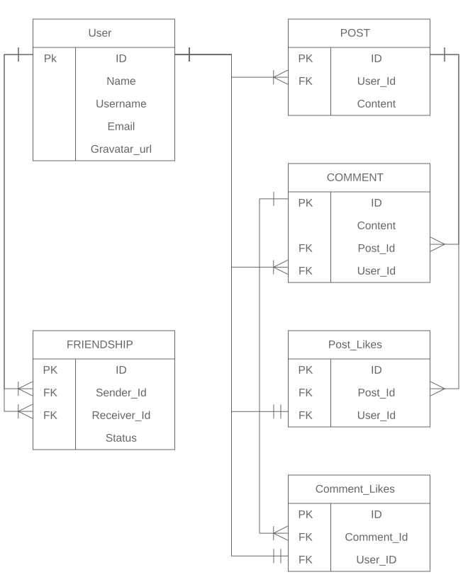

# Scaffold for social media app with Ruby on Rails

> The purpose of this project is to practice all skills and techniques learned during the course of Rails to build this social media application. And in this project, features like, creating posts, liking a post, adding friends were implemented.


<h3 align="center">Data Model Representation</h3>
<p align="center">
  
</p>

## Built With

- Ruby v2.7.0
- Ruby on Rails v5.2.4
- Capybara
- RSpec

## Deployment & Live Demo
This app was deployed on heroku and the demo of the project can be found below

```
[circle](https://murmuring-hamlet-08654.herokuapp.com/users/sign_in)
```

### Run tests

```
    rpsec --format documentation
```


## Getting Started

To get a local copy up and running follow these simple example steps.

### Prerequisites

Ruby: 2.6.3
Rails: 5.2.3
Postgres: >=9.5

### Setup

Install gems with:

```
bundle install
```

Setup database with:

```
   rails db:create
   rails db:migrate
```


### Usage

Start server with:

```
    rails server
```

Open `http://localhost:3000/` in your browser.


## Author

👤 **Adewale Orotayo** 
 [@didymus707](https://github.com/didymus707)

## 🤝 Contributing

Contributions, issues and feature requests are welcome!

Feel free to check the [issues page](issues/).

## Show your support

Give a ⭐️ if you like this project!

## Acknowledgments

- [Microverse](https://www.microverse.org)


